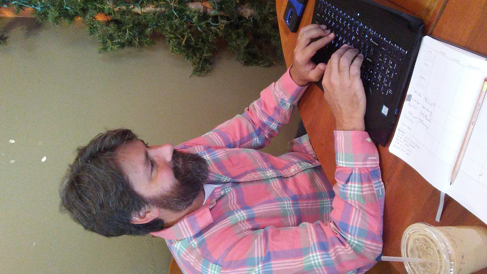

# About page

Hi! This blog is meant to do two things. 

First, one goal is to explore life as a **"FOSS Academic"** -- someone who uses Free and Open Source technologies to do academic work. I'm hoping that my discussions of FOSS technologies in an academic setting help others -- students, professors, university administrators -- understand the benefits and values of FOSS in the academy. I'm not a developer, but I am a professor who's been using FOSS to do his job for over a decade. I call this goal of exploring FOSS tools in the academy **Goal 1**.

Second, this blog has **Goal 2** -- otherwise known as my **nefarious purpose**. I'm planning a book-length project about the culture, politics, and technical elements of FOSS. So, in addition to writing about using FOSS tools to do academic work, I will also write about the world of FOSS itself. Sometimes, the two topics will collide in a single post. My intent here is to be more open about my own research process and writing.

You can learn more about the goals of the blog in the [introductory post](/2020/11/27/introduction.html).

As for me, I'm [Robert W. Gehl](https://www.robertwgehl.org), a professor of Communication and Media Studies at York University. My actual title is long: Ontario Research Chair of Digital Governance for Social Justice. The long title basically means I do research and teaching at York. I've also been a Fulbright Canada Research Chair of Communication, Media, and Film at the University of Calgary. I've written three books: [*Reverse Engineering Social Media*](http://tupress.temple.edu/book/1115), which won the Association of Internet Researchers Nancy Baym Book Award, [*Weaving the Dark Web*](https://mitpress.mit.edu/books/weaving-dark-web), and [*Social Engineering*](https://mitpress.mit.edu/9780262543453/) (co-authored with Sean Lawson). I've also published over two dozen peer-reviewed journal articles in venues such as *New Media & Society*, *Communication Theory,* and *Social Media + Society.*

<figure>
    
    <figcaption>Me, typing furiously on some document in a coffee shop.</figcaption>
</figure>

You can see more of my work at [my homepage](https://www.robertwgehl.org).

